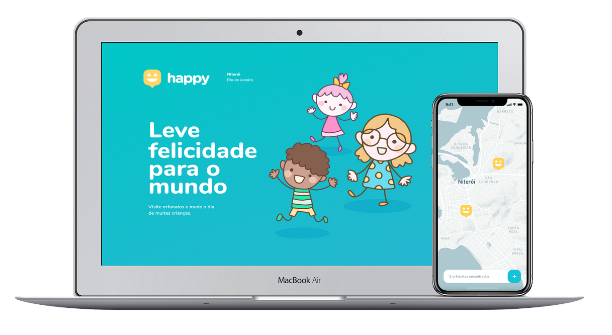

<h1 align="center">
  
</h1>

 
  <a href="https://www.linkedin.com/in/julia-almeida-matos/">
    

  <a href="#computer-technologies">Technologies</a>&nbsp;&nbsp;&nbsp;|&nbsp;&nbsp;&nbsp;
  <a href="#bookmark-about">About</a>&nbsp;&nbsp;&nbsp;|&nbsp;&nbsp;&nbsp;
  <a href="#memo-license">License</a>

 
  

<h4 align ="center"> 🚧   Under construction  🚧</h4>

  

 ## :computer: Technologies 
 
 This project was made using the following techologies:

- [Node.js](https://nodejs.org/en/) 
- [React](https://reactjs.org) 
- [SQLite](https://www.sqlite.org/index.html)
- [React Native](https://facebook.github.io/react-native/)
- [Expo](https://expo.io/)
- [TypeScript](https://www.typescriptlang.org/)

## :bookmark: About
A plataform to link people that are interested in visiting and helping with orphanages.

## :memo: License

This project is under the MIT license. For more details, see the  [LICENSE](LICENSE.md) file.

